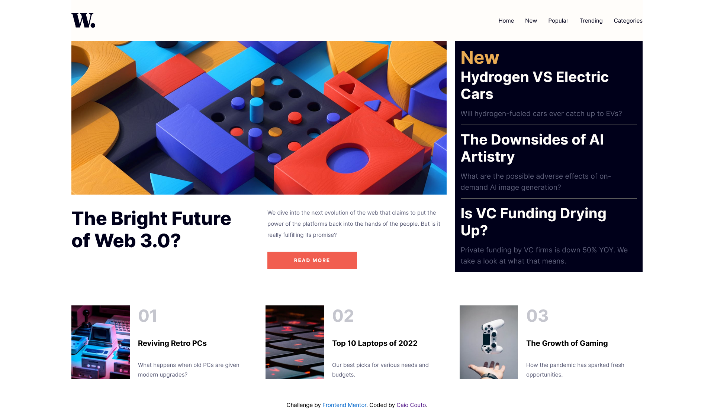

<h3 align="center">Frontend Mentor</h3>
<h1 align="center">News homepage</h1>

**pt.** Esta é uma solução para o [Desafio Págima de Notícias do Frontend Mentor](https://www.frontendmentor.io/challenges/news-homepage-H6SWTa1MFl).

**en.** This is a solution to the [News homepage challenge on Frontend Mentor](https://www.frontendmentor.io/challenges/news-homepage-H6SWTa1MFl).

---

## Table of contents

- [Overview](#overview)
  - [The challenge](#the-challenge)
  - [Screenshot](#screenshot)
  - [Links](#links)
  - [Built with](#built-with)

---

# Visão Geral (Overview)

## The challenge

**pt.** O desafio era construir uma página inicial de um site de notícias, o mais parecido possível com o design fornecido. **Os designs foram pensados para telas de 375px e 1440px de largura**.

**en.** The challenge was to build out this news website homepage and get it looking as close to the design as possible. **The designs were created to screen widths of 375px and 1440px**.

### Os usuário devem poder (Your users should be able to):

**pt.** 
- Visualizar o layout da forma mais otimizada para o tamanho da dela do dispositivo utilizado.
- Ver efeitos de *hover* e *focus* nos elementos interativos.

**en.**
- View the optimal layout for the interface depending on their device's screen size
- See hover and focus states for all interactive elements on the page

### Screenshot

### Links

- Live Site URL: [Github Pages](https://caiocouto.github.io/news-homepage-frontend-mentor/)

### Built with

**pt**
- HTML5 semântico
- CSS
    - Grid
    - Flexbox
- Mobile-first
- Javascript (Controle de Menu responsivo)

**en.**
- Semantic HTML5 markup
- CSS custom properties
- Flexbox
- CSS Grid
- Mobile-first workflow
- Javascript (Responsive Menu control)
